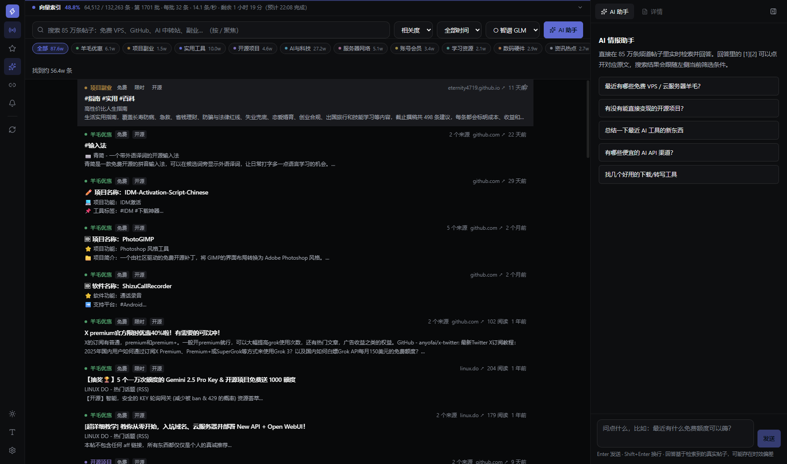
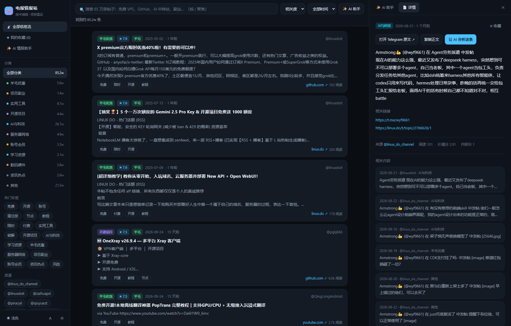
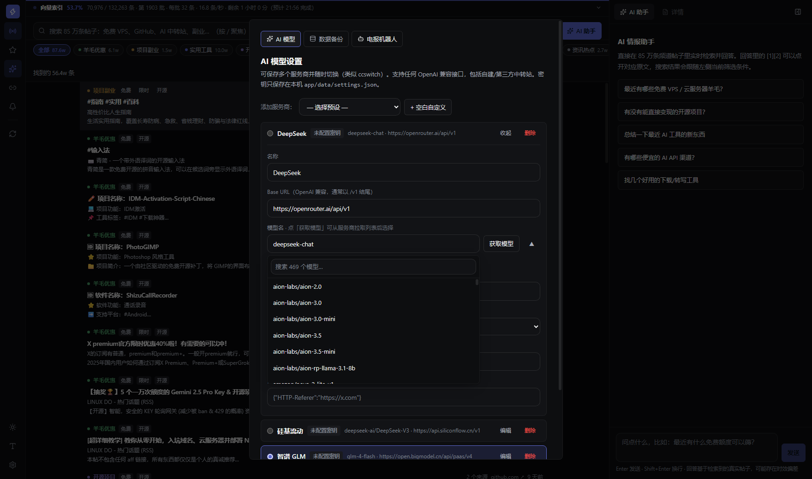
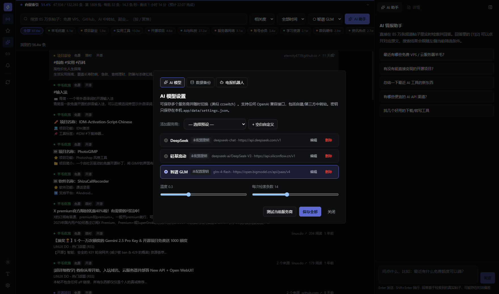
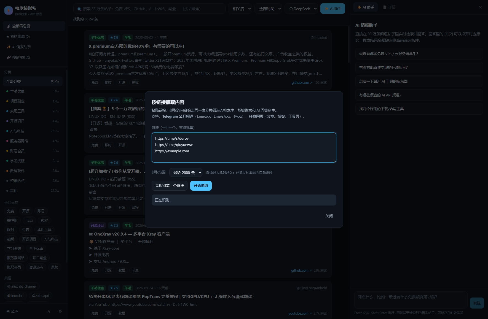
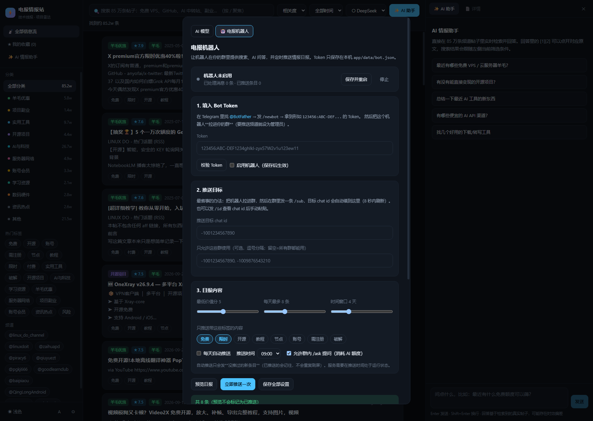

# 电报情报站 · Telegram Intel Station

把 Telegram 公开频道里的**技术线报、羊毛优惠、开源项目、副业信息**，抓下来、洗干净、做成一个能秒级检索、还能直接向 AI 提问的本地应用。

> 已抓取 **88 个频道**、**876,071 条**帖子入库；同事件自动聚合后信息流可见 **564,032 条**（少看 35.6% 的重复转发）
> 全文搜索 **30–60ms**（3 字以上词）。



## 它由两部分组成

| 模块 | 作用 |
|---|---|
| **数据管道**（`scrape/`） | 抓取 → 去重 → 反垃圾 → 分类打分 |
| **本地应用**（`app/`） | SQLite FTS5 全文检索 + React 界面 + AI 问答 |

## 快速开始

```bash
# 1. 抓取（支持断点续跑，已完成的频道会跳过）
npm run fetch

# 2. 从 data/raw 建库：去重 + 反垃圾 + 分类 + FTS 索引（约 1.5 GB，3~4 分钟）
npm run index:build

# 3. 启动应用
双击「启动情报站.cmd」，或手动：
npm start                      # → http://127.0.0.1:8317
```

常用脚本：

| 命令 | 作用 |
|---|---|
| `npm test` | 单元 + 集成测试（33 条用例） |
| `npm run fetch` | 增量抓取所有来源 |
| `npm run index:build` | 从 `data/raw` 全量重建数据库 |
| `npm run report` | 从数据库生成分类报告与 CSV |
| `npm run export` | 把数据库导出为 JSONL 归档 |
| `npm run all` | 抓取 → 建库 → 出报告 |

> 需要 **Node ≥ 24**（依赖内置的 `node:sqlite`）。

首次启动如果 `app/web/dist` 不存在，启动脚本会自动 `npm install` + `npm run build`。
也可以手动：`cd app/web && npm install && npm run build`

## 抓取原理

用的是 Telegram 官方**公开预览页** `t.me/s/<频道>?before=<消息ID>`：

- **无需登录、无需 Bot Token、不涉及私密内容**，只采集任何人打开网页都能看到的信息
- 深位跳跃实测**没有历史深度限制**，可以一直回溯到频道第一条帖子（已用 JIKE0906 验证到 id=1）
- 56 并发稳定跑满，46,731 次请求 13.5 分钟抓完 86 万条
- 分段写入 + `.done` 标记，**断点续跑**

## 数据流水线

```
t.me/s/<频道> ──scrape──▶ data/raw/<频道>/seg_*.jsonl ─┐
                                                       │
增量抓取 / 机器人收录 ──rawlog──▶ data/raw/_live/*.jsonl ─┤
                                                       │
                                    build-db（去重 + 反垃圾 + 分类）
                                                       ▼
                              app/data/intel.db  ★唯一真相★
                                                       │
                     ┌─────────────────────────────────┼──────────────────┐
                     ▼                                 ▼                  ▼
                检索 / 应用                       报告生成            export（归档）
                                                                  data/clean.jsonl
```

**设计要点**：数据库是唯一真相源。任何模块写数据都只能经过 `store.insertPost()`；
报告直接从数据库生成，不再读中间 JSONL，因此**不会出现报告与数据不一致**。
增量采集到的内容会同时追加到 `data/raw/_live/`，保证数据库随时可以从零完整重建。

**分类维度**：羊毛优惠 / 项目副业 / 实用工具 / 开源项目 / AI与科技 / 服务器网络 / 账号会员 / 学习资源 / 数码硬件 / 资讯热点

**过滤**：广告投放、黑产（博彩·色情·跑分）、招代理、纯链接刷屏、跨频道重复转发、需要联系方式引流的短帖。

## 信源扩展

信源不是拍脑袋定的，而是**从数据里挖 + 自动验证**：

    npm run discover          # 从库内 87 万条帖子里挖被高频 @ 的账号，逐个探测
    npm run discover:lists    # 从公开的精选列表仓库提取候选，过滤主题后探测
    npm run add:sources       # 批量加入并做首次抓取

探测结果会告诉你每个候选**能不能抓**：Telegram 的群没有公开预览页，只有频道能抓。
实测 260 个候选里只有 27 个是频道、227 个是群组；而从精选列表仓库里挖出的
**200 个里绝大多数是真频道**（少数派、极客分享、即刻精选、赚客通、VPS 优惠、
AwesomeChatGPT、GitHub Trends……），最终精选 77 个加入。

## 同事件聚合

同一件事被 5 个频道转发，刷屏很难受。系统会给每条算一个**聚簇键**，同键的归到
一个代表条目：卡片标注「N 个来源」，详情页列出全部来源，信息流默认只显示一条
（可随时用筛选栏的「合并重复来源」开关关掉）。

聚簇键的取舍是**先测量再设计**的：

| 信号 | 实测（87 万条） | 是否采用 |
|---|---|---|
| 前 60 字完全相同 | 2.4% | ❌ 已被建库去重覆盖，不值得上 SimHash |
| 「第一条链接相同」 | 44.3% | ❌ 假信号，那是 `t.me/<作者名>` 个人主页 |
| linux.do 同一话题跨频道搬运 | **63.3%** | ✅ 主力规则 |
| 具体内容页链接（GitHub 项目、文章） | — | ✅ 辅助规则，要求跨频道 |

排掉的三类误伤：丢掉 `?v=` `?id=` 会把**不同视频/应用**并成一条；站点首页和
`/home.php` `/cart.php` 这类通用页不是内容标识；同一链接在单个频道反复出现是
**签名**而非事件（例如频道每篇都附的推广链接）。

    npm run cluster           # 重算全量聚簇（约 20 秒）

## 应用功能

| 功能 | 说明 |
|---|---|
| 全文检索 | SQLite FTS5 三元组索引，中文子串匹配，关键词高亮 |
| 多维筛选 | 分类 / 标签 / 频道 / 时间范围 / 排序（相关度·价值分·最新·热度） |
| 卡片信息流 | 无限滚动，自动标注「羊毛」与高分条目 |
| 详情面板 | 全文、相关链接、相关内容推荐、收藏、一键让 AI 分析 |
| AI 问答 | 先检索再回答，回答里的 `[1][2]` 可点开对应原文 |
| 多服务商 | 保存多个 AI 服务商随时切换，支持自建/第三方中转站 |
| 其他 | 深浅主题、字号调节、收藏、URL 可分享（`?q=&cat=&post=&theme=`） |
| 按链接抓取 | 粘贴频道/网页链接，抓取后自动分类入库，增量去重 |



## AI 配置

点左下角 ⚙ →「添加服务商」选预设 → 填 API Key → 测试 → 保存。顶栏下拉框随时切换。

内置预设：DeepSeek、硅基流动、智谱 GLM、OpenAI、Moonshot、阿里通义、火山方舟、OpenRouter、**自定义中转**（任意 OpenAI 兼容接口，支持附加自定义请求头）。

### 模型列表自动获取

填好 Base URL 和 API Key 后，点模型名右侧的 **获取模型**，会自动调用服务商的模型列表接口，把可用模型列出来供选择（带搜索过滤，OpenRouter 这类聚合站有几百个模型也能秒筛）。

不同厂商的接口路径和返回格式差异很大，这里参考开源项目 **farion1231/cc-switch** 的做法做了三层兼容：

- **候选地址按序尝试**：`{base}/models` → `{base}/v1/models` → `{base}/api/v1/models`，并自动剥离 `/anthropic`、`/api/coding` 等兼容子路径后重试
- **返回格式兼容**：OpenAI 的 `data[].id`、智谱的 `models[].slug`、Anthropic 的 `data[].id` 都能解析
- **错误区分**：401/403 提示 Key 无效；全部候选 404 则提示该服务商不开放模型列表 —— 此时手动填模型名即可，也可以单独填「模型接口地址」精确指定

候选地址是**并发探测**的（不是按序等待），所以失败场景下最坏只等一轮超时，而不是 N 次串行超时。

用真实服务商无 Key 探测验证过（返回 401 即说明地址猜对了，只是缺鉴权）：

| 服务商 | 命中的候选地址 | 第几个命中 |
|---|---|---|
| DeepSeek | `/v1/models` | 1 |
| 硅基流动 | `/v1/models` | 1 |
| Moonshot Kimi | `/v1/models` | 1 |
| 阿里通义 | `/compatible-mode/v1/models` | 1 |
| 火山方舟 | `/api/v3/models` | 1 |
| OpenRouter | `/v1/models` | 1（公开，实测 469 个模型） |
| 智谱 GLM | `/api/paas/v1/models` | 2 |
| Moonshot（`/anthropic` 子路径） | 剥离后 `/v1/models` | 2 |

另外支持切换 **鉴权方式**（`Authorization: Bearer` / `x-api-key` / `x-goog-api-key`），自建中转站可以自由适配。



密钥只写入本机 `app/data/settings.json`，已在 `.gitignore` 中排除。



**不配置也能用**：AI 面板会退化为「检索原文」模式，仍然能搜、能看。

## 按链接抓取内容

应用左下角 **🔗 按链接抓取**，粘贴链接就能把内容抓进检索库 —— 走同一套分类器，能被搜索和 AI 问答命中。支持批量粘贴。

| 链接类型 | 能否抓取 | 说明 |
|---|---|---|
| 公开频道 `t.me/xxx`、`t.me/s/xxx`、`@xxx` | ✅ | 用公开预览页逐条回溯，可选 500 / 2000 / 1万 / 尽量全量 |
| 任意网页 `https://...` | ✅ | 抓正文，提取标题与描述，作为一条情报入库 |
| **群组** | ❌ | **Telegram 对群组不提供任何公开消息预览** —— 任何人都拿不到，不只是本工具。识别时会记录群名与人数 |
| 私密频道 `/c/`、邀请链接 `+xxx` | ❌ | 同上，未加入前没有公开内容 |

抓取是**增量**的：已存在的消息按 `(频道, 消息ID)` 自动跳过，所以重复抓同一个频道只会补新内容，不会重复入库。

> 群组想收录内容，唯一可行的方式是让机器人进群 —— 见上一节的「反向收录」。



## 电报机器人（接进你的群）

把机器人拉进你的群，群成员就能直接用那 85 万条频道库。

### 三步接上

1. 找 [@BotFather](https://t.me/BotFather) 发 `/newbot`，拿到形如 `123456:ABC-DEF...` 的 Token
2. 把机器人**拉进你的群**（要往频道推就设为管理员）
3. 应用左下角 ⚙ → 「🤖 电报机器人」→ 粘贴 Token → 勾选「启用机器人」→ 保存并重启

然后在群里发一条 `/sub`，推送目标的 chat id 会**自动填进设置里**（8 秒内刷新），不用手动查。

### 群内命令

| 命令 | 作用 |
|---|---|
| `/so <关键词>` | 搜情报，例：`/so 免费 VPS` |
| `/free` | 近 7 天的免费/限时高分羊毛 |
| `/ask <问题>` | AI 检索后回答（需先在应用里配好模型） |
| `/sub` | 把本群设为日报推送目标 |
| `/unsub` | 取消订阅 |
| `/id` | 查看本群 chat id |
| `/status` | 运行状态 |

### 情报日报

可以手动「立即推送一次」，也可以打开「每天自动推送」并设定时间（默认 09:00）。

日报内容按你设的条件筛选（标签、最低价值分、条数、时间窗口），并且**只发没推过的新条目** —— 已推送的 id 会记下来，不会重复刷屏。



### 反向收录：把群里的情报收进库

Telegram 的**群没有公开预览页**，所以 `t.me/s/` 抓不到群（这正是当初 `@qiuyueww` 拿不到数据的原因）。但机器人进群后是能收到消息的 —— 打开第 4 节的「收录群消息」后：

- 群里聊到的工具/羊毛会自动走**同一套分类器**，进入同一个检索库
- 能被全文检索命中，也能被 AI 问答检索到
- 按 `(群, 消息ID)` 去重，不会重复入库
- 自动过滤太短的消息（<8 字）和机器人自己发的消息
- 会自动提取正文里的链接和 Telegram 的 `text_link` 实体

⚠️ 要让机器人读到**普通消息**（而不是只收到命令），二选一：

1. **把机器人设为群管理员**（最简单，推荐）
2. 或在 @BotFather 里 `/setprivacy` 关闭隐私模式，然后**把机器人移出群再重新拉进来**（隐私设置需要重新入群才生效）

### 几个设计说明

- 用**长轮询**（`getUpdates`），不需要公网 IP、不需要 HTTPS 证书、不用配 webhook，本机开着就能收消息
- Token 存在 `app/data/bot.json`，已加入 `.gitignore`
- 可以填「只允许这些群使用」把命令限制在你自己的群里
- `/ask` 会消耗 AI 额度，可单独关闭
- 推送时间点服务需要处于运行状态（双击 `启动情报站.cmd` 保持开着）
- 自建了 Bot API 服务器的话，用环境变量 `TG_API_BASE` 指过去即可

## 目录结构

```
core/                 领域层：纯函数、无 IO、可直接单测
  text.mjs            文本工具（含 toGram 单字分词）
  parse.mjs           t.me 页面解析 / 链接解析 / 网页正文提取
  net.mjs             抓取（唯一有 IO 的 core 模块）
  classify.mjs        分类、反垃圾、价值打分
  query.mjs           FTS 查询构造（trigram / gram 双模式）
  rank.mjs            排序与 bm25 加权

app/server/           服务层
  store.mjs           ★ 存储层唯一入口：schema 与全部写入
  build-db.mjs        从 data/raw 全量重建数据库
  rawlog.mjs          增量数据落原始日志（保证可重建）
  source.mjs          按链接采集（频道 / 网页）
  bot.mjs             Telegram 机器人（命令 / 日报 / 群收录）
  ai.mjs              多服务商配置、RAG、流式输出
  index.mjs           HTTP API + 静态资源服务

app/web/              React 19 + Vite 8 + Tailwind 4
scrape/               离线脚本
  scrape.mjs          批量抓取
  report.mjs          从数据库生成报告与 CSV
  rankings.mjs        高频资源网站 / 推荐频道榜
  insight.mjs         深度洞察报告
  export.mjs          数据库导出为 JSONL 归档
test/                 集成测试
output/               报告产物
```

## API

```
GET  /api/search?q=&category=&tags=&channel=&from=&sort=&page=&size=
GET  /api/facets                    # 分类/频道/标签统计
GET  /api/post/:id
GET  /api/related/:id               # 相关内容推荐
GET  /api/settings                  POST /api/settings
POST /api/settings/active           # 切换当前 AI 服务商
POST /api/settings/test             # 测试连通性
POST /api/chat                      # SSE 流式问答
```

## 开发

```bash
node app/server/index.mjs    # 后端 :8317
cd app/web && npm run dev    # 前端 :5317（已配置 /api 代理到 8317）
```

改完后端直接重启进程；改完前端要 `npm run build` 才会作用到 :8317。

## 数据说明

仓库**不包含**抓取到的数据、索引数据库和生成的大体积导出（合计约 3GB），只保留：

- 全部**源码**
- `data/stats.json`（数据集统计）
- `output/分类报告/*.md`（生成的精选报告，可直接阅读）

按上面「快速开始」跑一遍即可完整复现。

## 免责声明

- 所有内容均来自 Telegram **公开频道**的公开信息，版权归原作者所有，仅供学习研究。
- 数据源中包含破解软件、第三方节点、账号交易等灰色内容，请自行判断风险；标签含「风险」「破解」的条目在报告中已标注。
- 本项目只做信息聚合与检索，不对任何第三方资源的可用性、合法性负责。
